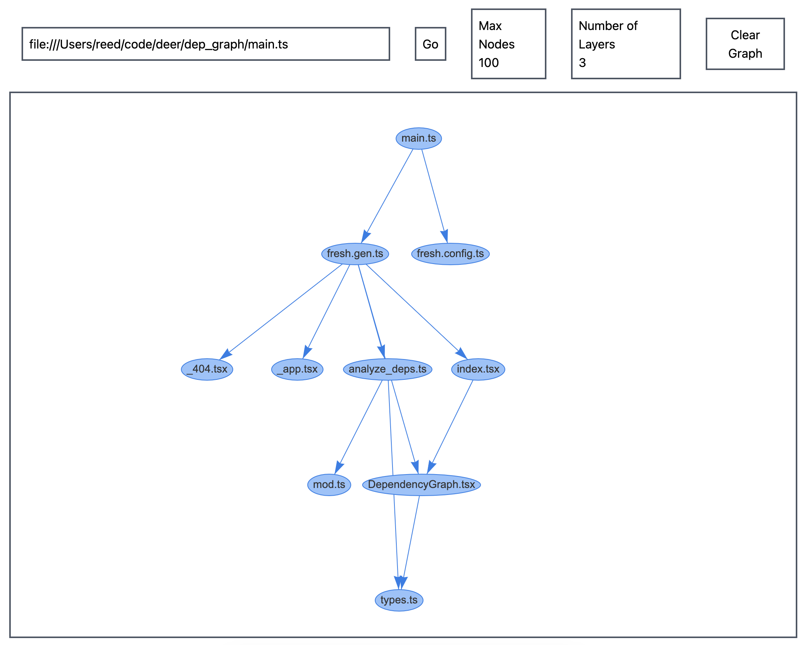

# Dep Graph

Dep Graph is utility that allows for dependencies of a module to be explored in
a graphical manner. You can test it out at https://dep-graph.deno.dev/.

The initial version looks like this. The UI _might_ improve.

This is mainly a test project to learn more about
[deno_graph](https://github.com/denoland/deno_graph) and various network diagram
visualization utilities. Currently this project uses
[vis-network](https://github.com/visjs/vis-network). But I plan on switching to
[cytoscape](https://github.com/cytoscape/cytoscape.js) since it seems to be more
powerful and more actively maintained.
